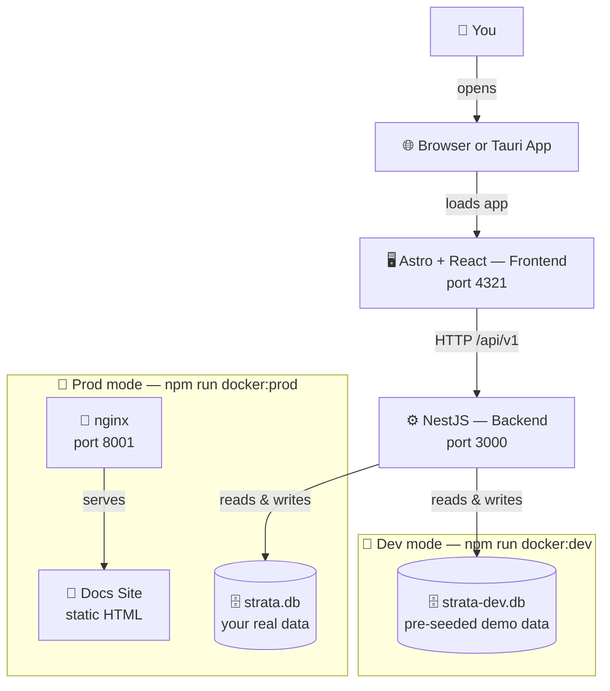

> 🏗️ **How does Strata work?** Three loosely coupled services: a NestJS hexagonal backend, an Astro+React frontend, and a static Starlight docs site.

Strata is composed of three services that work together. Each service has its own dedicated page:

- [Backend →](/docs/backend/) — NestJS hexagonal architecture, Prisma, layers, DI
- [Frontend →](/docs/frontend/) — Astro + React islands, state management, data flow
- [Docs Site →](/docs/docs-site/) — Astro Starlight, nginx, Mermaid, local dev

## Data Flow

> **Dev** (`docker:dev`): backend uses `strata-dev.db` (seeded demo data). nginx and docs are not started.
> **Prod** (`docker:prod`): backend uses `strata.db` (your real data). nginx serves the pre-built docs site on port 8001.

## Services at a Glance

| Service | Technology | Dev Port | Prod Port | Source |
|---------|-----------|----------|-----------|--------|
| Backend | NestJS + Prisma + SQLite | `3000` | `3000` | `backend/` |
| Frontend | Astro 6 + React 19 | `4321` | `4321` | `front/` |
| Docs | Astro Starlight + nginx | `8001` | `8001` | `docs/` |

## Dev vs Production

The key difference between dev and prod is the **database file**:
- **Dev** — uses `strata-dev.db` (pre-seeded demo data)
- **Prod** — uses `strata.db` (your real data)

Swagger UI (`/swagger`) is enabled by default in **both** environments. Set `ENABLE_SWAGGER=false` to disable it.

See [Configuration](/docs/configuration/) for the full comparison table.

