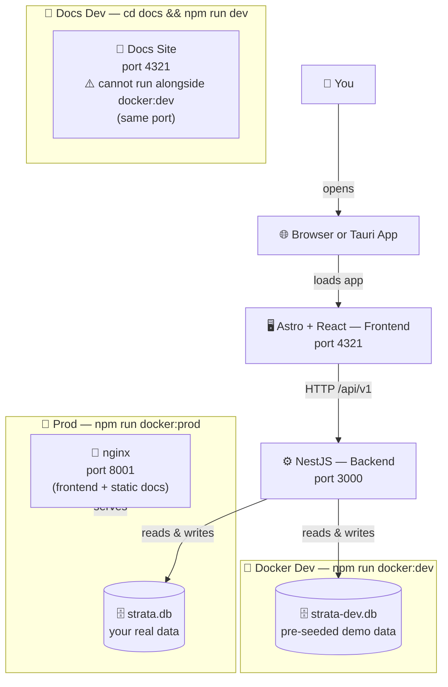

> 🏗️ **How does Strata work?** Three loosely coupled services: a NestJS hexagonal backend, an Astro+React frontend, and a static Starlight docs site.

Strata is composed of three services that work together. Each service has its own dedicated page:

- [Backend →](/docs/backend/) — NestJS hexagonal architecture, Prisma, layers, DI
- [Frontend →](/docs/frontend/) — Astro + React islands, state management, data flow
- [Docs Site →](/docs/docs-site/) — Astro Starlight, nginx, Mermaid, local dev

## Data Flow

> **Docker Dev** (`docker:dev`): backend at port 3000, frontend at port 4321, using `strata-dev.db`. The docs site is **not started** — run it separately with `cd docs && npm run dev`, but note it also uses port 4321, so you can't run both at the same time.
>
> **Docker Prod** (`docker:prod`): backend at port 3000, nginx at port 8001 serves both the frontend and the pre-built static docs site.

## Services at a Glance

| Service | Technology | Dev Port | Prod Port | Notes |
|---------|-----------|----------|-----------|-------|
| Backend | NestJS + Prisma + SQLite | `3000` | `3000` | Always port 3000 |
| Frontend | Astro 6 + React 19 | `4321` (docker:dev) | `8001` via nginx | nginx proxies prod frontend |
| Docs | Astro Starlight | `4321` (manual, `cd docs && npm run dev`) | `8001` via nginx | ⚠️ port 4321 conflicts with docker:dev frontend |

## Dev vs Production

The key difference between dev and prod is the **database file**:
- **Dev** — uses `strata-dev.db` (pre-seeded demo data)
- **Prod** — uses `strata.db` (your real data)

Swagger UI (`/swagger`) is enabled by default in **both** environments. Set `ENABLE_SWAGGER=false` to disable it.

See [Configuration](/docs/configuration/) for the full comparison table.

See the [Portfolio Snapshot Recalculation](/docs/technical/portfolio-snapshot-recalculation/) technical guide for details on the algorithm.

Asset types use a two-level hierarchy: **13 type codes** grouped into **6 groups**.

| Group | Types |
|-------|-------|
| `FINANCIAL` | CHECKING_ACCOUNT, SAVINGS_ACCOUNT, CASH, STOCKS, CRYPTO, BONDS |
| `REAL_ESTATE` | REAL_ESTATE |
| `PERSONAL_PROPERTY` | PERSONAL_PROPERTY, VEHICLE |
| `PHYSICAL_COLLECTIONS` | COLLECTIBLES |
| `LIABILITIES` | LOAN |
| `OTHER` | BUSINESS, OTHER |

The `group` field is used to:
- Color-code the net worth history chart (LIABILITIES = red, below axis)
- Provide filter modes in the net worth chart ("By group" toggle)
- Drive the asset types management page (`/asset-types`)

## Transaction Wiring

### Create Asset → ACQUIRE Transaction

When you create an asset, you provide:
- **Acquisition date** — when you acquired the asset
- **Acquisition price** — what you paid (in EUR)

Strata atomically creates:
1. The `Asset` record
2. A `Transaction(type=ACQUIRE, unitPrice=acquisitionPrice, quantity, currency='EUR', occurredAt=acquisitionDate)`
3. An `AssetSnapshot(value=acquisitionPrice × quantity, observedAt=acquisitionDate)` — which triggers the portfolio cascade (see [Portfolio Snapshot Recalculation](/docs/technical/portfolio-snapshot-recalculation/))

**Invariant**: Every asset has exactly **1** ACQUIRE transaction. This is enforced at the service level.

### Dispose Asset → DISPOSE Transaction

When you mark an asset as disposed (via `PATCH /api/v1/assets/:id/dispose`):
1. Asset is marked `disposed = true`
2. A `Transaction(type=DISPOSE, …)` is created
3. Portfolio cascade fires from the disposal date — future net worth no longer includes this asset

**Invariant**: Every asset has **0 or 1** DISPOSE transaction.

### ADJUST (v2 — reserved)

`TransactionType.ADJUST` is in the schema as a reserved hook for a future bank API / MCP integration. In v2, bank transactions will flow in as ADJUST entries → triggering the same portfolio snapshot cascade. The `AssetSnapshot` remains the single source of truth in both versions.

## Roadmap

In v2, bank API / MCP integrations will create `ADJUST` transactions that flow into the existing `assetSnapshotService` pipeline. No breaking changes — just a new entry point into the existing cascade chain.

