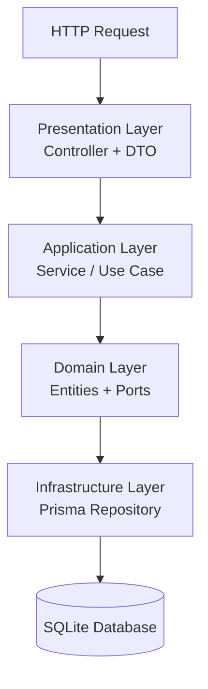

The Strata backend follows **Hexagonal Architecture** (Ports & Adapters) with four strict layers.

## Stack

| Component | Technology | Purpose |
|-----------|-----------|---------|
| Runtime | Node.js 24 | Server runtime |
| Framework | NestJS 11 | HTTP framework, DI container, decorators |
| Language | TypeScript 5 | End-to-end type safety |
| ORM | Prisma 7 | Schema-first, type-safe DB access + migrations |
| Database | SQLite via better-sqlite3 | Embedded, zero-server, portable DB file |
| Validation | class-validator + class-transformer | DTO validation at the HTTP boundary |
| API Docs | @nestjs/swagger | Auto-generated OpenAPI / Swagger UI |
| Testing | Jest + Supertest | Unit (224) + E2E (44) tests |

## Directory Structure

```
backend/src/
├── domain/              ← Pure TypeScript — no framework imports
│   ├── entities/        ← Business entities (Asset, AssetSnapshot, PortfolioSnapshot, Category, Tag, AssetType)
│   ├── ports/           ← Repository interfaces (abstract classes)
│   └── exceptions/      ← Domain-specific exceptions
├── application/         ← Use cases as @Injectable() services
│   └── services/        ← AssetService, AssetSnapshotService, PortfolioSnapshotService, CategoryService, TagService, AssetTypeService
├── infrastructure/      ← Framework & persistence implementations
│   ├── prisma/          ← PrismaService, PrismaModule
│   └── repositories/    ← Prisma repository implementations
└── presentation/        ← HTTP layer
    ├── controllers/     ← NestJS @Controller() with Swagger decorators
    ├── dto/             ← Request DTOs (class-validator)
    │   └── responses/   ← Response DTOs (@ApiProperty)
    └── filters/         ← Domain exception → HTTP error mapping
```

## Layer Rules

| Layer | Can Import | Cannot Import |
|-------|-----------|---------------|
| Domain | Nothing (pure TypeScript) | NestJS, Prisma, any framework |
| Application | Domain | Infrastructure, Presentation |
| Infrastructure | Domain, Application | Presentation |
| Presentation | Domain, Application | Infrastructure (via DI) |

## Dependency Injection

NestJS modules wire abstract ports to concrete implementations:

```typescript
// app.module.ts
{
  provide: IAssetRepository,        // abstract class (port)
  useClass: PrismaAssetRepository,  // concrete implementation
}
```

Controllers receive services via constructor injection. Services receive repository ports via constructor injection. The DI container resolves the full dependency graph.

## Request Tracing (X-Request-ID)

Backend HTTP requests pass through `RequestIdMiddleware`.

- If the client sends `X-Request-ID`, Strata reuses it.
- Otherwise, Strata generates one (UUID).
- The ID is attached to the request context and echoed in response headers.
- Error filters include this ID in JSON error payloads for easier debugging.

This enables end-to-end correlation across browser logs, API logs, and error responses.

## Data Flow



## Running Locally

```bash
cd backend
npm install
npx prisma migrate deploy
npx prisma db seed   # Only needed on first run — loads demo data
npm run start:dev    # http://localhost:3000
```

:::note[Docker seeds only on first start]
When running via Docker, `docker-start.sh` checks whether the database file exists before starting. If fresh (first run), it seeds automatically. If the database already exists, the seed step is skipped so user data and deliberate demo-asset deletions are preserved.
:::

- API: `http://localhost:3000/api/v1`
- Swagger UI: `http://localhost:3000/swagger`
- Tests: `npm test` (unit) · `npm run test:e2e` (E2E)
