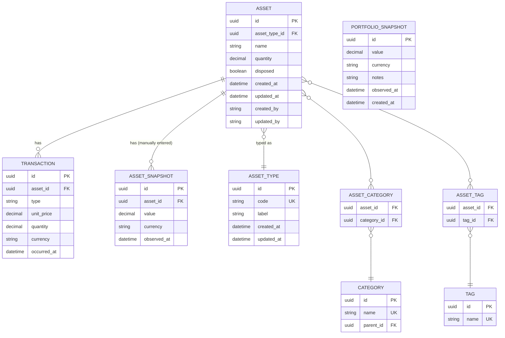
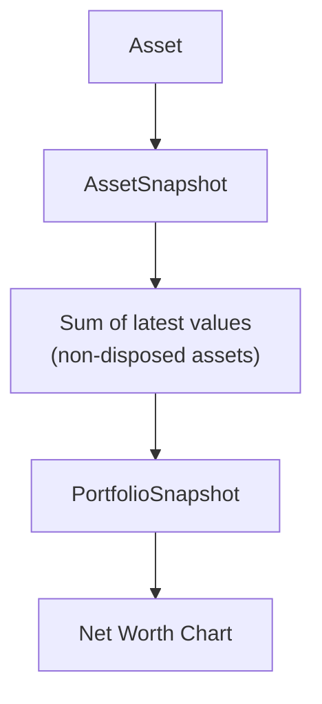

## Entity-Relationship Diagram (Database / ORM)

👉 Persistence-oriented


`PORTFOLIO_SNAPSHOT` is **standalone** — it has no foreign key to any other table. It records the total net worth at a moment in time, computed from asset snapshots.

## Conceptual Flow

👉 Behavior-oriented



## Transaction Types

- `ACQUIRE`: Buying/receiving an asset (increases quantity)
- `DISPOSE`: Selling/giving away an asset (decreases quantity)
- `ADJUST`: Manual correction/adjustment

## Design Decisions

### 1. Why no Portfolio entity?

There is no `Portfolio` table. Categories and tags handle all grouping and organization needs. An asset can belong to multiple categories (hierarchical or cross-cutting) and carry any number of tags. A dedicated "portfolio" row would just be an extra layer of indirection with no added value for a single-user app.

### 2. Why is PortfolioSnapshot standalone?

`PortfolioSnapshot` captures the **total** net worth at a moment in time. It is not "owned" by a portfolio because there is no portfolio entity. It is a global snapshot of everything you track — a record of the sum, not a sub-view of a group.

### 3. Base currency: EUR (hardcoded for alpha)

All monetary values are stored in EUR. Multi-currency support is planned for a future version. `currency` fields on snapshots are informational and currently always `"EUR"`.

### 4. Loan values are stored negative

Liabilities (asset type `LOAN`) store negative values in `AssetSnapshot.value` (e.g., `-€180,000` for a mortgage). Net worth sums all asset snapshot values — positives increase it, negatives decrease it.

```
Net Worth = Sum of latest AssetSnapshot.value per non-disposed asset

Example:
  Checking Account:    +€10,000
  Paris Apartment:    +€420,000
  Mortgage Loan:      -€180,000
  ─────────────────────────────
  Net Worth:          +€250,000
```
