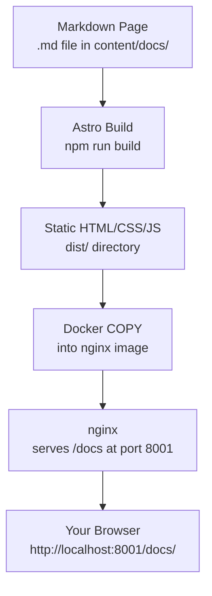

The Strata documentation is a separate Astro Starlight site. It is **pre-built to static HTML** at image build time, then served by nginx in Docker — no Node.js required at runtime.

## Stack

| Component | Technology | Why |
|-----------|-----------|-----|
| Framework | Astro 6 + Starlight 0.38 | Content-focused static sites, built-in search (Pagefind), dark mode |
| Styling | Starlight defaults + `custom.css` | Minimal custom CSS; Starlight handles dark/light |
| Search | Pagefind (built-in to Starlight) | Zero-JS search at build time — no external dependency |
| Diagrams | Mermaid.js (CDN) | `mermaid` code blocks render to interactive diagrams |
| Serving (Docker) | nginx | Static HTML/CSS/JS — nginx is lighter than a Node.js process |

## Why nginx? (SSR vs Static — the key difference)

Strata has two Astro projects. Both use Astro, but with **different output modes**:

| | Frontend (`front/`) | Docs site (`docs/`) |
|---|---|---|
| `astro.config.mjs` | `output: "server"` | `output: "static"` |
| Pages generated | At **request time** (live, per user visit) | At **build time** (once, into plain HTML files) |
| Needs a runtime process | ✅ Node.js must be running | ❌ No process needed — just files on disk |
| Served by | `@astrojs/node` adapter (Node.js) | nginx — a lightweight static file server |
| Port | 4321 (dev + Docker) | 8001 (dev + Docker) |

**Why `output: "server"` for the frontend?** The frontend renders pages that embed `PUBLIC_API_URL` and serve React hydration scripts — it must run a Node.js process both locally and in Docker.

**Why `output: "static"` for the docs?** The docs are just Markdown → HTML. Nothing is computed per-request. nginx reads pre-built files from disk and sends them directly — far simpler and faster than running a Node.js server.

**Rule of thumb:** If a page needs to run code at request time, use Node.js. If all pages are known at build time, use a static server.

**Config proof:**
```js
// front/astro.config.mjs
output: 'server',         // Node.js process required
adapter: node({ mode: 'standalone' }),

// docs/astro.config.mjs
// No output field = defaults to 'static'
// No adapter needed
```

## Directory Structure

```
docs/
├── src/
│   ├── assets/          ← Logo and static assets
│   ├── content/
│   │   └── docs/        ← All Markdown pages (one file = one page)
│   ├── plugins/         ← Custom remark plugins (remark-mermaid.mjs)
│   └── styles/          ← custom.css (Starlight CSS overrides)
├── astro.config.mjs     ← Sidebar structure, integrations, social links
├── Dockerfile           ← Build static site → copy to nginx
└── nginx.conf           ← Serve /docs from /usr/share/nginx/html/docs
```

## Data Flow (Production)



## Adding a Page

1. Create `docs/src/content/docs/your-page.md` with a frontmatter title.
2. Add it to the sidebar in `docs/astro.config.mjs`.
3. Run `npm run build` in `docs/` to verify it builds.

## Mermaid Diagrams

Use standard fenced code blocks with `mermaid` as the language:

````

````

The custom `remark-mermaid.mjs` plugin converts these blocks to `<pre class="mermaid">` elements, and the Mermaid.js CDN script renders them client-side.

## Running Locally

```bash
cd docs
npm install
npm run dev      # Astro dev server (hot reload) — http://localhost:8001/docs/
npm run build    # Static build into docs/dist/
npm run preview  # Preview the static build
```

> Local dev URL: `http://localhost:8001/docs/` (port 8001 matches Docker — no conflict with the frontend on 4321).
