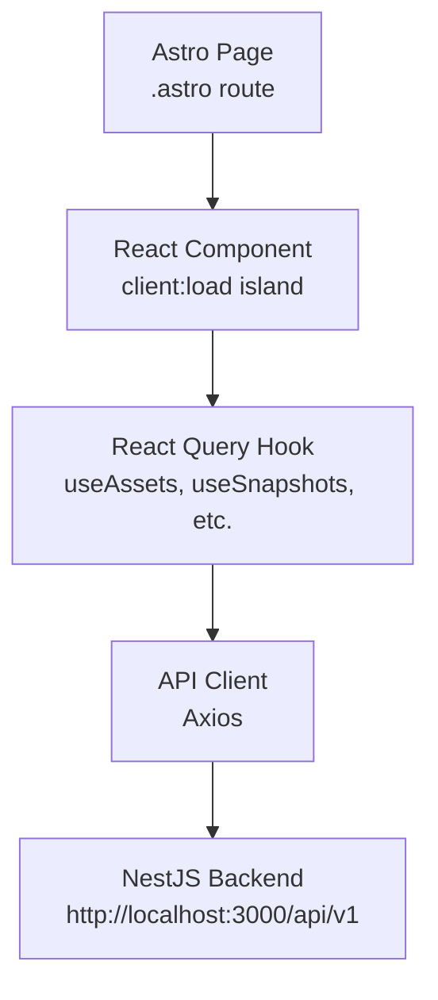

The Strata frontend is built with **Astro** and **React**, providing a clean, reactive asset management interface.

## Stack

| Component | Technology | Purpose |
|-----------|-----------|---------|
| Framework | Astro 6 | SSR routing, static page generation |
| UI Library | React 19 | Interactive component islands (`client:load`) |
| Styling | Tailwind CSS 4 | Utility-first CSS, `@theme` custom properties |
| Components | shadcn/ui-inspired | Accessible, unstyled UI primitives |
| Charts | Recharts | Data visualization (net worth timeline, allocation pie) |
| State | TanStack React Query | Server state, caching, background refetch |
| HTTP | Axios | Typed API client |
| Testing | Vitest + Playwright | Unit (306) + E2E tests |

## Directory Structure

```
front/src/
├── components/
│   ├── ui/              ← Reusable UI primitives (Button, Card, Table, Badge…)
│   ├── layout/          ← AppShell, Sidebar, Header, VersionBadge
│   ├── dashboard/       ← Dashboard widgets (NetWorthChart, AllocationChart, SnapshotTable)
│   ├── assets/          ← Asset list, detail, create/edit forms
│   ├── categories/      ← Category tree with CRUD
│   ├── tags/            ← Tag list with CRUD
│   └── settings/        ← Theme toggle, backup export/import, About
├── pages/               ← Astro .astro page routes
├── layouts/             ← MainLayout.astro
├── lib/
│   ├── api/             ← Axios API clients (assets, snapshots, categories…)
│   ├── hooks/           ← React Query hooks
│   └── version.ts       ← Auto-generated version info (git-ignored)
└── stores/              ← Zustand stores (theme, backup state)
```

## Pages

| Route | Description |
|-------|------------|
| `/` | Dashboard — net worth chart, allocation chart, recent snapshots |
| `/assets` | Asset list with search, filters, create |
| `/assets/:id` | Asset detail — snapshots, transactions, tags, categories |
| `/categories` | Category tree with CRUD |
| `/tags` | Tag list with CRUD |
| `/settings` | Theme toggle, backup export/import |

## Portfolio Snapshots

The dashboard's **Take Snapshot** button (or `POST /api/v1/portfolio-snapshots`) computes the current net worth by summing the latest `AssetSnapshot.value` for every non-disposed asset and saves the result as a `PortfolioSnapshot`. This record feeds the net worth timeline chart.

`GET /api/v1/portfolio-snapshots/current-value` returns the live computed value without persisting a snapshot — useful for displaying the current total in the UI without creating a new data point.

## Design System

- **Dark + Light themes** with system preference detection
- CSS custom properties for all colors via Tailwind `@theme`
- Consistent component API across all UI primitives
- Responsive layout with collapsible sidebar

## Data Flow

Pages are Astro routes that render React components as interactive islands:



## Running Locally

```bash
cd front
npm install
npm run dev      # Development server at http://localhost:4321
npm run build    # Production build
npm run preview  # Preview production build
npm test         # Vitest unit tests
npm run test:e2e # Playwright E2E tests
```
